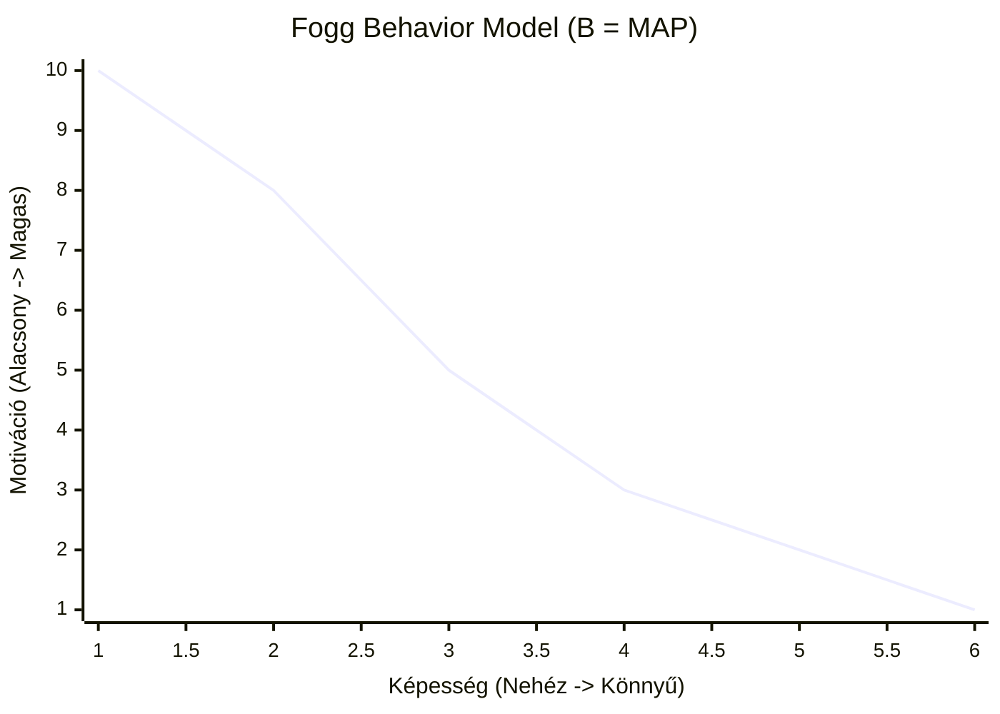

A CRO (Conversion Rate Optimization – Konverzióoptimalizálás) koncepcióját nagyon sokan félreértik, és pusztán „gombok színének A/B tesztelésére” (két különböző verzió összehasonlító tesztelése) egyszerűsítik le. A valóságban az igazi CRO a viselkedéspszichológia, a kvalitatív kutatás és a heurisztikus (tapasztalati úton történő) elemzés szisztematikus alkalmazása annak érdekében, hogy minden kognitív súrlódást megszüntessünk a folyamat során.

## Miért Buknak El a Felhasználói Tesztek (Az E-kereskedelmi Paradoxon)
Az analitika megmutatja, *mit* csinálnak a felhasználók az oldalon, de azt sosem árulja el, hogy *miért*. Sok marketinges a User Testingre (Felhasználói Tesztekre) támaszkodik a "miért" megtalálásához, de ez gyakran veszélyes kognitív torzításokat hoz be a képbe – ilyen például az SDR (Social Desirability Bias – Társadalmi megfelelési kényszer). A felhasználók egyszerűen másképp viselkednek, ha tudják, hogy egy tesztkörnyezetben figyelik őket.

Éppen ezért kritikus fontosságú a szakértői **Heurisztikus Elemzés**. Ez bevált pszichológiai keretrendszerek alapján, tudatos és tudatalatti szinteken is képes értékelni egy weboldalt.

## A Heurisztikus Elemzés 5 Dimenziója
André Morys keretrendszere alapján egy jól konvertáló landing page-nek (érkező oldalnak) öt alapvető pszichológiai dimenziónak kell megfelelnie. Amikor egy oldalt auditálunk (vizsgálunk), a következőket vesszük górcső alá:

| Dimenzió | Felhasználói Kérdés | Optimalizációs Cél |
| :--- | :--- | :--- |
| **Relevancia** | "Jó helyen járok?" | A Message Match (üzenetegyezés) fenntartása a hirdetés és a landing oldal főcíme között. |
| **Bizalom & Tájékozódás** | "Bízhatok ebben a cégben?" | Vizuális hierarchia, letisztult design és egyértelmű navigációs irányítópontok. |
| **Stimuláció** | "Miért pont most vegyem meg?" | Egy rendkívül erős UVP (Unique Value Proposition – Egyedi értékajánlat) megfogalmazása, ami azonnali dopamint (jutalomérzetet) vált ki. |
| **Biztonság & Kényelem** | "Biztonságos és egyszerű?" | A súrlódások (friction) kíméletlen eltávolítása, a kortizol (stressz) csökkentése, valamint a garanciák kiemelése. |
| **Megerősítés** | "Jól döntöttem?" | Vásárlás utáni megnyugtatás a Buyer's Remorse (vásárlói megbánás) teljes elkerülésére. |

## A Fogg Viselkedési Modell (Fogg Behavior Model)
A híres Fogg Viselkedési Modell szerint egy kívánt cselekvés csak és kizárólag akkor történik meg, ha a **Motiváció**, a **Képesség** (Ability) és egy **Kiváltó ok** (Prompt) hajszálpontosan egyazon pillanatban találkozik.

*(Az Akcióvonal: Ha a felhasználók a görbe alá esnek, lepattannak. Ha a kiváltó ok, például egy CTA (Call to Action – Cselekvésre ösztönző gomb) pillanatában a görbe felett vannak, konvertálnak.)*

- **Alacsony Képesség (Súrlódás):** Ha egy pénztár űrlap 15 kötelező mezőt kér be, még a legmagasabb motiváció sem fogja megmenteni a konverziót.
- **Magas Motiváció (Stimuláció):** Lenyűgöző marketing szövegek írásával (Motiváció növelése) és a folyamatok drasztikus egyszerűsítésével (Képesség növelése) a felhasználót magabiztosan az Akcióvonal fölé tolod.

## Végezz Heurisztikus Auditot!
Mielőtt lefuttatnál egyetlen A/B tesztet is, végezz el egy őszinte heurisztikus áttekintést az oldaladon. Képzeld magad teljesen a felhasználó helyébe. A design egyértelműséget vagy inkább zűrzavart sugároz? Hitelesen és természetesen alkalmazod Robert Cialdini meggyőzési alapelveit, mint például a Social Proofot (Társadalmi bizonyíték) vagy a Scarcity-t (Szűkösség)?

Amint eltávolítod a kognitív súrlódást az útból, a konverziók maguktól, teljesen természetesen megindulnak.
