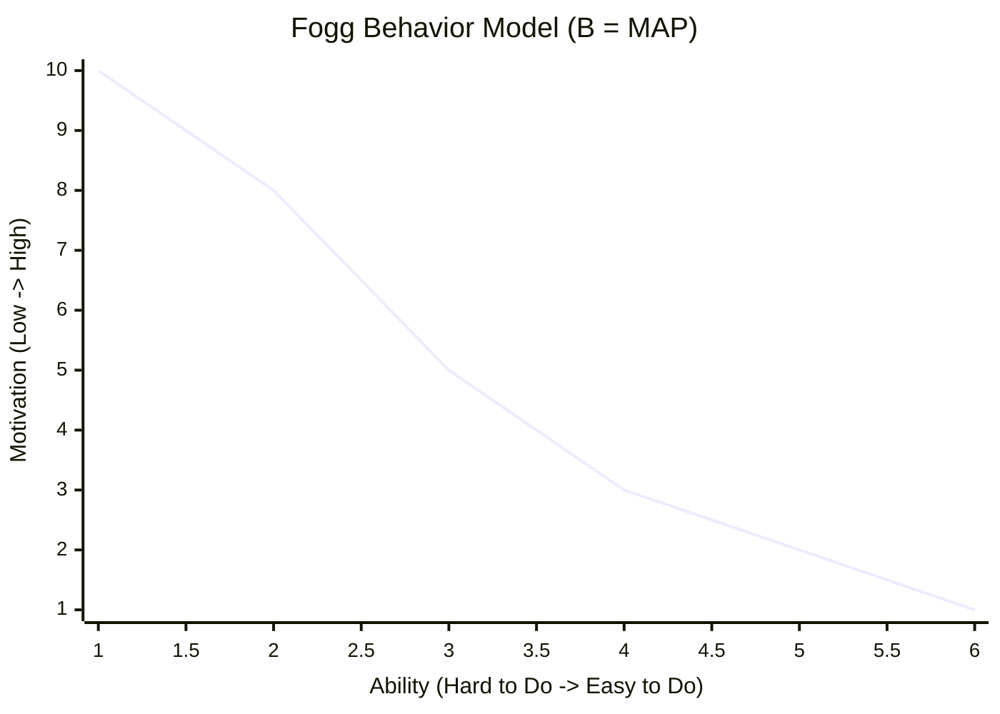

# The Psychology of CRO: Turning Friction into Flow

Conversion Rate Optimization (CRO) is often misunderstood as simply "A/B testing button colors." In reality, true CRO is the systematic application of behavioral psychology, qualitative research, and heuristic analysis to remove cognitive friction.

## Why User Testing Fails (The E-Commerce Paradox)
Analytics show us *what* users are doing, but they don't tell us *why*. Many marketers rely on User Testing to find the "why," but this introduces dangerous cognitive biases like the **Social Desirability Response (SDR)**. Users act differently when they know they are being watched.

This is why Expert **Heuristic Evaluation** is critical. It evaluates a page based on proven psychological frameworks on both conscious and subconscious levels.

## The 5 Dimensions of Heuristic Evaluation
Based on André Morys' frameworks, a high-converting landing page must satisfy five core psychological dimensions. When auditing a page, we look for:

| Dimension | User Question | Optimization Goal |
| :--- | :--- | :--- |
| **Relevance** | "Am I in the right place?" | Message match between the Ad and the Landing Page headline. |
| **Trust & Orientation** | "Can I trust this company?" | Visual hierarchy, professional design, and clear directional cues. |
| **Stimulation** | "Why should I buy this *now*?" | Strong Unique Value Proposition (UVP) triggering dopamine (reward). |
| **Security & Convenience** | "Is it safe and easy?" | Removing friction, reducing cortisol, highlighting guarantees. |
| **Confirmation** | "Did I make the right choice?" | Post-purchase reassurance to prevent buyer's remorse. |

## The Fogg Behavior Model
According to the Fogg Behavior Model, a behavior occurs when **Motivation**, **Ability**, and a **Prompt** converge at the exact same moment.

*(The Action Line: If users fall below the curve, they bounce. If they are above the curve when triggered, they convert.)*

- **Low Ability (Friction):** If a checkout form asks for 15 fields, even high motivation won't save the conversion.
- **High Motivation (Stimulation):** By writing compelling copy (increasing Motivation) and simplifying forms (increasing Ability), you push the user above the Action Line.

## Conduct a Heuristic Audit
Before running a single A/B test, perform a heuristic walkthrough of your site. Put yourself in the user's shoes. Does the design inspire clarity or confusion? Are you applying Cialdini’s principles of persuasion (like Social Proof and Scarcity) authentically?

Once you remove the cognitive friction, conversions will naturally flow.
