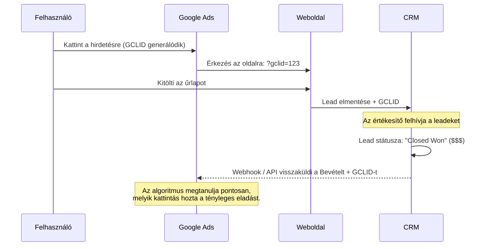

# Ne Égesd a Büdzsét: Így Kényszerítsd a Google Ads-t, Hogy Vásárlókat Hozzon

Azok az idők, amikor még elég volt csupán pontos egyezésű (exact match) kulcsszavakra licitálni és karba tett kézzel várni a leadeket (érdeklődőket), végleg lejártak. A modern Google Ads egy rendkívül komplex, gépi tanulás, viselkedési szignálok és közönségadatok által vezérelt ökoszisztéma. Ha skálázni akarod az üzletet, azonnal át kell váltanod a "kulcsszó fókuszú" gondolkodásról a "vásárló fókuszú" gondolkodásra.

Ha nem veszed át proaktívan az irányítást, a Google örömmel elkölti a teljes büdzsédet olyan alacsony szándékú (low-intent) forgalomra, amiből sosem lesz vásárlás. Mutatom, hogyan kényszerítheted az algoritmust arra, hogy valóban neked dolgozzon.

## SKAGs (Single Keyword Ad Groups) vs. Konszolidáció
Történelmileg a legmagasabb CTR (Click-Through Rate – Átkattintási arány) eléréséhez hiper-szegmentált SKAG (Egykulcsszavas hirdetéscsoport) struktúrára volt szükség. A képlet szigorú és világos volt:
1. Pontos egyezésű kulcsszó a hirdetéscsoportban.
2. Ugyanez a kulcsszó a **Címsor 1**-ben.
3. Ugyanez a kulcsszó a **Display URL Path**-ben (a hirdetésben látható link útvonalában).

Miért? Mert a Google számára a relevancia a legfontosabb mutató. Magas relevancia = Magas CTR = Magas Minőségi Mutató = Olcsóbb Kattintások.

Bár a SKAG struktúra megtanított minket a szigorú relevancia fegyelmére, a 2026-os hirdetési környezet **Konszolidációt** követel meg. A hiper-töredezett fiókok ugyanis teljesen kiéheztetik a gépi tanulási algoritmusokat. A kulcsszavakat ma már szemantikai témák és vásárlói szándék (intent) alapján kell csoportosítanod. Így a rendszer gyorsan kiléphet a "tanulási fázisból", miközben a dinamikus kulcsszó-beillesztések révén továbbra is megőrzöd a szigorú szövegrelevanciát.

| Megközelítés | Felépítés / Struktúra | Algoritmusra Gyakorolt Hatás | Adatigény |
| :--- | :--- | :--- | :--- |
| **Hagyományos (SKAGs)** | 1 Kulcsszó / Hirdetéscsoport | Kiéhezett (a tanulási fázis folyton újraindul) | Alacsony |
| **Modern (Konszolidált)** | Téma-alapú Csoportosítás | Telített (gyors tanulás, stabil CPA – Egy konverzió költsége) | Magas (Tiszta szerveroldali adatok) |

## A Jéghegy-effektus és a Keresési Kifejezések
Az egyik legveszélyesebb csapda fiókkezelés során a **Jéghegy-effektus** – amikor a gondosan megcélzott kulcsszavaid csak a jéghegy látható csúcsát jelentik, és a költségvetésedet valójában a felszín alatti, teljesen irreleváns keresési kifejezések (Search Queries) emésztik fel.
- **A Megoldás:** Szigorú, heti szintű SQR (Search Query Report – Keresési kifejezések jelentése) optimalizálás. Kíméletlenül és folyamatosan ki kell zárnod az irreleváns forgalmat negatív kulcsszavakkal. Nulla tolerancia az elpazarolt hirdetési büdzsék irányába!

## VBB (Value-Based Bidding) & Offline Konverziók
Ha pusztán "űrlapkitöltésekre" optimalizálod a fiókot, akkor azt mondod a Google-nek, hogy keressen neked űrlapkitöltőket, ne pedig fizető vásárlókat. A különbség hatalmas.

Hogy nyerj 2026-ban, a Google Ads Data Manager API-n keresztül át kell térned a **VBB (Value-Based Bidding – Értékalapú licitálás)** stratégiára. Az algoritmust a saját CRM (Customer Relationship Management – Ügyfélkapcsolat-kezelő) rendszeredből származó "Closed Won" (Megnyert/Sikeres lezárás) bevételi adatokkal kell táplálnod.

*(A GCLID a Google Click Identifier rövidítése, ami a kattintást azonosító egyedi kód.)*

Ha hosszú, akár 90 napot is meghaladó B2B értékesítési ciklusod van, használj **Helyettesítő Értékeket (Proxy Values)**. Rendelj egy becsült pénzértéket egy "MQL" (Marketing Qualified Lead – Marketing szempontból minősített érdeklődő) státuszhoz, hogy a licitáló algoritmus folyamatosan kapjon pozitív adatáramlást és visszacsatolást.

A fizetett média skálázása ma mély strukturális fegyelmet követel. Urald az adatkörforgást, tanítsd az algoritmust agresszívan, és a nap végén többé nem forgalmat fogsz vásárolni, hanem bevételt.
