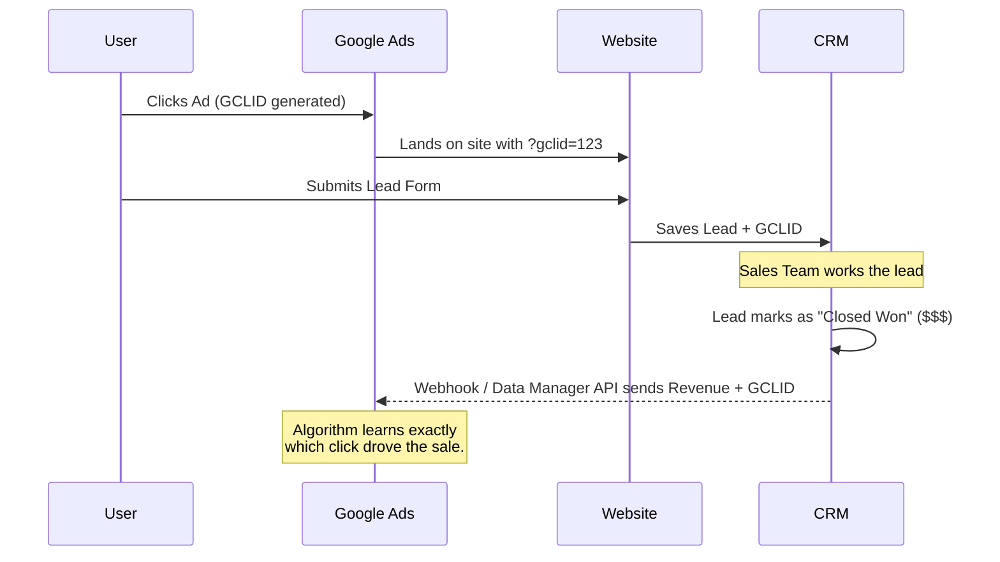

The days of simply bidding on exact match keywords and watching the leads roll in are over. Modern Google Ads is an ecosystem driven by machine learning, behavioral signals, and audience intel. If you want to scale a paid media program, you must shift from a "keyword mindset" to a "buyer mindset."

If you don't take control, Google will gladly spend your budget on low-intent traffic. Here is how you force the algorithm to work for you.

## Single Keyword Ad Groups (SKAGs) vs. Consolidation
Historically, achieving the highest possible Click-Through Rate (CTR) required hyper-granular SKAGs. The formula was strict:
1. Exact Match Keyword inside the Ad Group.
2. That same Keyword used as **Headline 1**.
3. That same Keyword used in the **Display URL Path**.

Why? Because relevancy is the ultimate metric Google cares about. High relevancy = High CTR = High Quality Score = Cheaper Clicks. 

While SKAGs taught us the discipline of strict relevancy, the 2026 landscape demands **Consolidation**. Hyper-fragmented accounts starve the machine learning algorithms. You must group keywords by semantic theme and intent, allowing the system to exit the "learning phase" quickly while maintaining that strict ad-copy relevance via dynamic insertions.

| Approach | Setup Structure | Algorithm Impact | Data Requirement |
| :--- | :--- | :--- | :--- |
| **Legacy (SKAGs)** | 1 Keyword per Ad Group | Starved (learning phase resets constantly) | Low |
| **Modern (Consolidated)** | Theme-based Grouping | Saturated (fast learning phase, stable CPA) | High (Clean Server-Side Data) |

## The Iceberg Effect & Search Queries
One of the most dangerous traps is the **Iceberg Effect**—where the keywords you bid on are just the tip of the iceberg, and your budget is being drowned by irrelevant search queries beneath the surface.
- **The Fix:** Rigorous, weekly Search Query Report (SQR) optimization. You must ruthlessly negative-match irrelevant traffic to protect your budget. Zero tolerance for wasted ad spend.

## Value-Based Bidding (VBB) & Offline Conversions
If you are optimizing for "form fills," you are telling Google to find you form fillers, not buyers.

To win in 2026, you must utilize **Value-Based Bidding (VBB)** through the Google Ads Data Manager API. You must feed the algorithm with "Closed Won" CRM revenue data.

If you have a long B2B sales cycle that exceeds the 90-day conversion window, use **Proxy Values**. Assign a dollar value to a "Marketing Qualified Lead" (MQL) status to keep the bidding algorithm fed with positive reinforcement.

Scaling paid media today requires deep structural discipline. Master the data loop, train the algorithm aggressively, and you stop buying traffic and start buying revenue.
