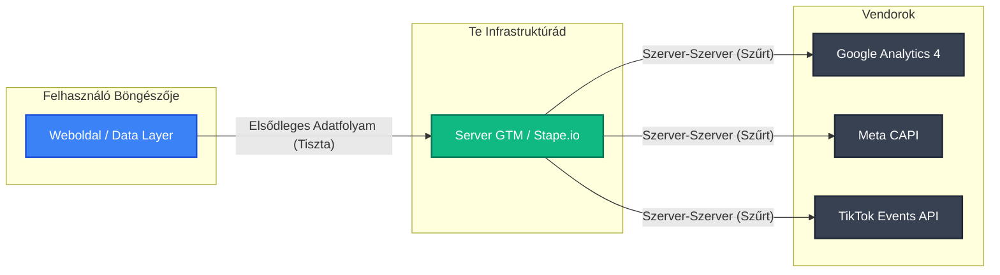

# Miért Nem Opció Többé a Server-Side Tracking 2026-ban

Ha még mindig kizárólag a felhasználók böngészőjében futó (kliensoldali) pixelekre támaszkodsz, akkor folyamatosan veszíted el a legértékesebb adataidat. Ez ennyire egyszerű.

Egy olyan korszakban, amelyet az agresszív böngészős adatvédelmi funkciók, mint az Apple ITP (Intelligent Tracking Prevention – Intelligens követésmegelőzés) és a Firefox ETP (Enhanced Tracking Protection – Fokozott követésvédelem), a hirdetésblokkolók, valamint a szigorú hozzájárulás-kezelési szabályozások (mint a Consent Mode v2) határoznak meg, a hagyományos mérés rohamléptékben veszíti el a pontosságát. A megoldás? **A Server-Side Tracking (SST – Szerveroldali követés).**

## A Kliensoldali Mérés Problémája
Hagyományosan a mérőkódok (mint a Google Analytics vagy a Facebook Pixel) közvetlenül a felhasználó böngészőjében (a kliensnél) futnak le. A böngésző az adatokat ezután közvetlenül a harmadik fél platformjaira küldi.
- **Adatvesztés:** A hirdetésblokkolók és a privát böngészők kíméletlenül blokkolják ezeket a kéréseket. 2026-ban ez a teljes forgalom 20–40%-át is érintheti.
- **Lassú Oldalbetöltés:** A rengeteg JavaScript kód lelassítja a weboldaladat, ami egyenesen megöli a CRO-t (Conversion Rate Optimization – Konverzióoptimalizálás).
- **Biztonsági Kockázatok:** A kliensoldali kódok potenciálisan kiszivárogtathatják a PII-t (Personally Identifiable Information – Személyes adatok) különböző, nem ellenőrzött harmadik felek számára.

## A Szerveroldali Paradigmaváltás
A Server-Side Tracking beiktat egy közvetítőt: egy felhőalapú szervert, amit teljes egészében te irányítasz.

### Legfőbb Előnyök
- **Megtörhetetlen Pontosság:** Mivel az adatokat egy saját aldomainen (például `data.yourdomain.com`) keresztül vezeted át, a sütik valódi belső (first-party) sütiként jönnek létre, megkerülve ezzel az ITP korlátozásait.
- **Villámgyors Weboldalak:** Tucatnyi marketing script eltávolítása a böngészőből drasztikusan javítja a Core Web Vitals (a Google weboldal-teljesítményt mérő alapvető mutatói) értékeket.
- **Teljes Adatkontroll:** Te döntöd el, hogy a Google vagy a Meta (a Meta CAPI – Conversions API segítségével) pontosan mit láthat. Ez elengedhetetlen a GDPR (Általános Adatvédelmi Rendelet) megfeleléshez, hiszen a PII adatokat még azelőtt anonimizálhatod, hogy azok elérnék a hirdetési hálózatokat.

## Implementáció és Infrastruktúra
Bár az egyedi GCP (Google Cloud Platform – Google Felhőszolgáltatása) telepítések maximális kontrollt nyújtanak, 2026-ra a menedzselt tárhelyszolgáltatók – mint a **Stape.io** és az **Addingwell** – lettek az iparági standardok, mivel drasztikusan csökkentik a szerver karbantartási költségeit.

Ha a jövő adatarchitektúrájára tekintünk, a szerveroldali mérés és a BigQuery (a Google adattárház szolgáltatása) párosítása jelenti az arany standardot minden olyan vállalkozás számára, amely komoly összegeket költ fizetett hirdetésekre. Enélkül lényegében bekötött szemmel optimalizálod a kampányaidat.
