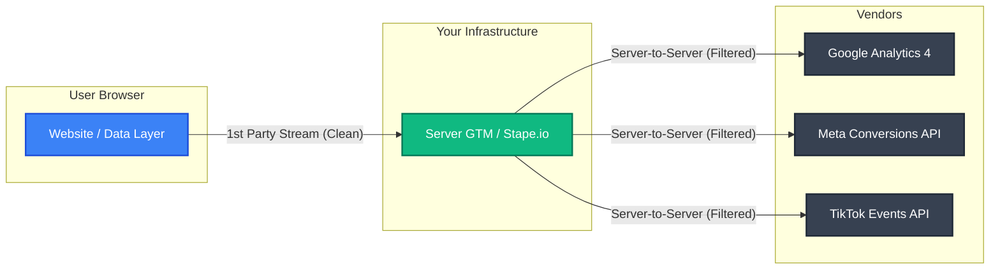

If you're still relying entirely on client-side pixels, you are bleeding data. Period.

In an era defined by aggressive browser privacy features (like Apple's ITP and Firefox's ETP), ad blockers, and strict consent management policies (like Consent Mode v2), traditional tracking is rapidly losing its accuracy. The solution? **Server-Side Tracking (SST).**

## The Problem with Client-Side Tracking
Traditionally, tags (like Google Analytics, Facebook Pixel) fire on the user's browser (the client). The browser sends data directly to the third-party platforms.
- **Data Loss:** Ad blockers and privacy browsers strip these requests. In 2026, this impacts 20% to 40% of all traffic.
- **Slow Page Speeds:** Heavy JavaScript tags slow down your website, killing your Conversion Rate (CRO).
- **Security Risks:** Client-side tags can potentially expose Personally Identifiable Information (PII) to unvetted third parties.

## The Server-Side Paradigm Shift
Server-Side Tracking introduces a middleman: a cloud server that you control.

### Key Benefits
- **Unbreakable Accuracy:** By routing data through a first-party subdomain (e.g., `data.yourdomain.com`), cookies are set as true first-party cookies, bypassing intelligent tracking prevention (ITP) restrictions.
- **Lightning Fast Websites:** Removing dozens of marketing scripts from the browser dramatically improves core web vitals.
- **Complete Data Control & Consent Mode v2:** You decide exactly what Google or Meta gets to see. This is essential for GDPR compliance, allowing you to redact PII before it ever reaches advertising networks.

## Implementation & Infrastructure
While custom Google Cloud Platform (GCP) deployments offer maximum control, managed hosting providers like **Stape.io** and **Addingwell** have become the 2026 industry standards, drastically reducing server maintenance overhead.

As we look toward the future of data architecture, Server-Side Tagging paired with BigQuery is the gold standard for any business spending serious money on paid acquisition. Without it, you are optimizing your campaigns while blindfolded.
